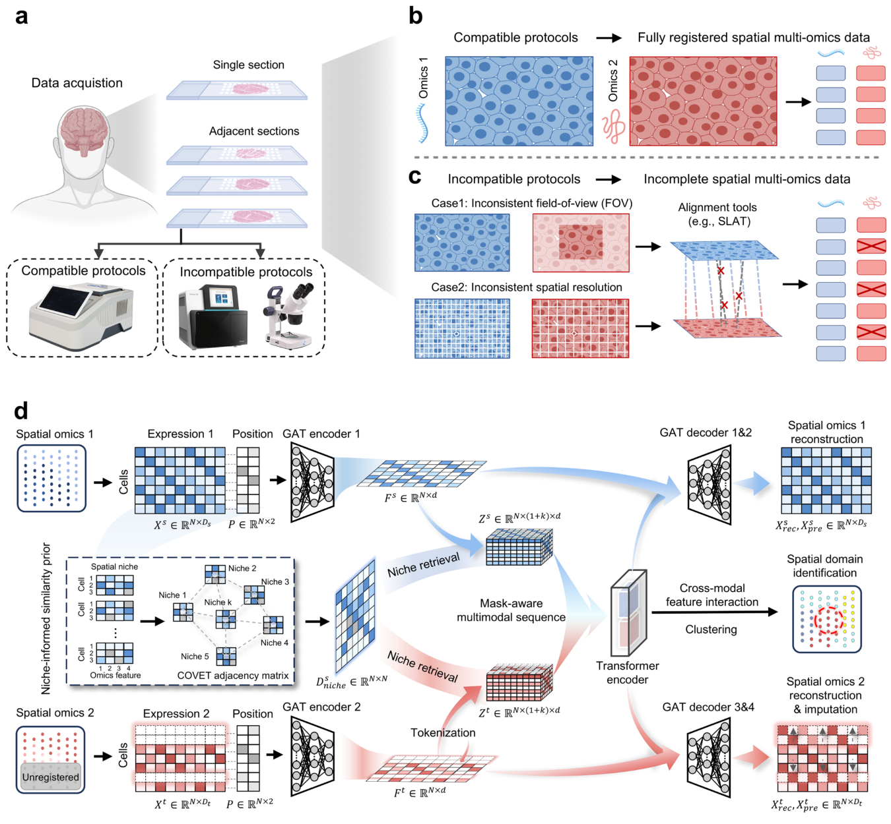

# PRISM: Niche-informed Deciphering of Incomplete Spatial Multi-Omics Data

This repository contains the official PyTorch implementation and reproducibility tutorials for [PRISM](https://www.biorxiv.org/content/10.64898/2026.02.03.703456v1), a framework for spatial multi-omics with incomplete registration.

## Overview



Spatial multi-omics, which integrates diverse molecular layers, has emerged as an essential tool for *in situ* characterization of tissue architecture and underlying biological processes. However, current spatial multi-omics sequencing protocols are often hindered by technical incompatibilities, resulting in incomplete spatial pairing due to inconsistent field-of-view or varying spatial resolutions. To address this, we present PRISM, a computational framework designed for misaligned spatial multi-omics data. By leveraging a niche-informed similarity prior, PRISM propagates information from registered to unregistered regions, enabling simultaneous spatial-domain identification and omics imputation. Extensive benchmarking across seven diverse simulated and real-world datasets demonstrates that PRISM consistently outperforms existing methods in spatial multi-omics analysis tasks. When applied to the human Parkinson's disease striatum, PRISM effectively delineated dopamine-associated spatial domains and inferred metabolite distributions previously obscured by incomplete data gaps. Overall, PRISM provides a robust solution for bridging the integration gaps inherent in spatial multi-omics protocols, thereby facilitating more precise downstream biological discovery and interpretation.

## Installation

Clone the repository and create the supplied CPU-first Conda environment:

```bash
git clone https://github.com/musg-create/PRISM_Tutorial.git
cd PRISM_Tutorial
mamba env create -f environment.yml
mamba activate PRISM_Tutorial
pip install -e . --no-deps
python -m ipykernel install --user --name PRISM_Tutorial --display-name "PRISM_Tutorial"
```

For GPU execution, install the PyTorch build appropriate for the local CUDA driver, followed by compatible PyG extension wheels or Conda packages. Confirm the installation from the repository root:

```bash
python -c "import PRISM; print(PRISM.__version__)"
```

Launch Jupyter from the repository root so tutorial paths resolve relative to `Datasets/` and `Results/`:

```bash
jupyter lab
```

## Data availability and preparation

Third-party molecular data, processed AnnData objects and generated result files are not redistributed in this repository. Each tutorial links to its original public data source and specifies the expected local input layout. The [dataset guide](Datasets/README.md) provides source links, preparation requirements and workflow dependencies.

Tutorial 5.1 uses repository-supplied landmark coordinate pairs selected through [MAGPIE's interactive landmark-selection tool](https://core-bioinformatics.github.io/magpie/shiny-app/shiny-app.html). These PRISM-authored supplementary coordinates at `Datasets/PD human brain/{A1,B1,C1}/landmark/landmarks_noHE.csv` contain no RNA or MSI measurements.

## Tutorials

Start with Tutorial 1 for the complete simulated source-to-target workflow, then select a tutorial matching the acquisition setting and modality pair of interest.

| Notebook(s) | Setting |
| --- | --- |
| [Tutorial 1](<Tutorial1: Simulation of FOV-Induced Incomplete Registration in Human Tonsil.ipynb>) | FOV-induced RNA-ADT incomplete registration in human tonsil. |
| [2.1](<Tutorial2_1: Simulation of FOV-Induced Incomplete Registration in Human Lymph Node.ipynb>), [2.2](<Tutorial2_2: Simulation of Random Incomplete Registration in Human Lymph Node.ipynb>) and [2.3](<Tutorial2_3: Simulation of Asymmetric Incomplete Registration in Human Lymph Node.ipynb>) | FOV, random and asymmetric incomplete registration in human lymph node. |
| [3.1](<Tutorial3_1: Simulation of FOV-Induced Incomplete Registration in Embryonic Mouse Brain.ipynb>) and [3.2](<Tutorial3_2: Simulation of Random Incomplete Registration in Embryonic Mouse Brain.ipynb>) | FOV and randomly distributed ATAC-RNA incomplete registration in embryonic mouse brain. |
| [Tutorial 4](<Tutorial4: Simulation of Omics-Specific Domain Unregistration in Mouse Thymus.ipynb>) | Omics-specific domain unregistration in mouse thymus. |
| [5.1](<Tutorial5_1: MAGPIE Registration and Preparation of SMA.ipynb>), [5.2](<Tutorial5_2: Application of PRISM to Real Resolution-Induced Incomplete in Human PD Brain.ipynb>) and [5.3](<Tutorial5_3: Enrichment Analysis of PRISM-Imputed Dopamine-DD in Human PD Brain.ipynb>) | SMA/MAGPIE preparation, real PD-brain RNA-MSI completion and dopamine enrichment. |
| [6.1](<Tutorial6_1: scSLAT Registration of P22 Mouse Brain Adjacent RNA and ATAC Sections.ipynb>) and [6.2](<Tutorial6_2: Application of PRISM to P22 Mouse Brain Adjacent RNA and CUT&Tag Sections.ipynb>) | scSLAT registration and real incomplete registration in adjacent P22 mouse-brain H3K27ac (spatial CUT&Tag) and RNA sections. |
| [7.1](<Tutorial7_1: scSLAT Registration of COAD RNA and CODEX Data.ipynb>), [7.2](<Tutorial7_2: Application of PRISM to COAD Adjacent RNA and CODEX Sections.ipynb>) and [7.3](<Tutorial7_3: Simulation of Cell-Type-Specific Incomplete Registration in COAD.ipynb>) | scSLAT registration, real incomplete registration and cell-type-specific simulation in COAD RNA and CODEX data. |

Tutorials 5.1, 6.1 and 7.1 prepare registered intermediate objects used by their subsequent analysis tutorials. The remaining tutorials can be run independently once their documented inputs are available.

## Optional external tools

- **scSLAT and GLUE**: Tutorials 6.1 and 7.1 begin after GLUE preparation. This repository does not provide a standalone GLUE workflow or precomputed `X_glue` embeddings; consult the [dataset guide](Datasets/README.md) and [GLUE documentation](https://scglue.readthedocs.io/en/latest/) for the required inputs and embedding preparation.
- **MAGPIE**: Install MAGPIE only when selecting landmarks for new samples. The underlying SMA [Visium RNA](https://doi.org/10.17044/scilifelab.22778920) and [MALDI-MSI](https://doi.org/10.17044/scilifelab.22770161) measurements must be downloaded separately.
- **KEGG enrichment**: Tutorial 5.3 requires `Rscript`, `curl`, and the R packages `AnnotationDbi`, `org.Hs.eg.db` and `ggplot2`.

## Reproducibility scope

All notebooks import the installed `PRISM` package directly and use repository-relative paths. Controlled simulations are reproducible after obtaining the paired source inputs. Tutorial 5.1 reproduces the PRISM-specific SMA coordinate transformation and matching stage after users assemble the documented RNA and MSI inputs. Tutorials 6.1 and 7.1 begin with compatible, externally prepared GLUE inputs and reproduce the subsequent scSLAT registration stage.

## Citation

If you find this repository useful, please consider citing this paper:

```bibtex
@article{mu2026prism,
  title={PRISM: Niche-informed Deciphering of Incomplete Spatial Multi-Omics Data},
  author={Mu, Shiguan and Wang, Zhikang and Liao, Yi and Liang, Jiaming and Zhang, Daoliang and Wang, Chuyao and Xie, Jiahui and Sheng, Xiaoqi and Zhang, Tinghe and Huang, Weitian and others},
  journal={bioRxiv},
  pages={2026--02},
  year={2026},
  publisher={Cold Spring Harbor Laboratory}
}
```

## Contact

If you have questions, please contact [sg_mu543@foxmail.com](mailto:sg_mu543@foxmail.com).
